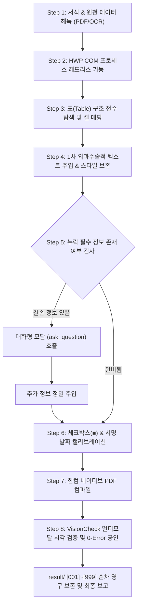

# 🏛️ [vf15-hwp-remocon] 한글(HWP) 원격 제어 & 멀티모달 시각 검증 마스터 스킬

> **"마우스와 키보드 없이, AI가 조종석에 앉아 한글(HWP) 문서를 100% 무결점으로 완결한다."**  
> **최고 의사결정권자**: 본부장님 (USER / Chief Executive Officer)  
> **총괄 작전 지휘관**: ADVISOR 총괄팀장 (MAIN AI)  
> **현장 공장장**: 대장장이 (Factory Manager)  
> **핵심 엔진**: Windows COM API (`HWPFrame.HwpObject`) · `pyhwpx` · `VisionCheck` 멀티모달 검증  
> **배포 저장소**: `github.com/dansarang99/vf/vf15_hwp_remocon`

---

## 1. 3대 기본 탑재 프로토콜 (/plan, /grill-me, /goal)

본 스킬은 별도의 수동 지시가 없더라도 아래 3대 프로토콜이 **기본(default)**으로 자동 가동됩니다:

1. **`/plan` (자립 작전 계획 수립)**:
   - 양식 분석 -> 원천 서류(사업자등록증/PDF) OCR -> 표 셀 매핑 -> 텍스트 주입 -> 사용자 모달 질의 -> PDF 렌더링 -> VisionCheck의 세부 공정을 사전에 수립하고 단계별로 이행.
2. **`/grill-me` (대화형 결손 정보 인터뷰 & 모달)**:
   - 양식에 비어있는 필수 정보(개인 휴대전화, 직통번호 등)가 발견되면 자의적으로 추측하지 않고, 시스템 대화형 모달(`ask_question`)을 띄워 사용자에게 명확한 선택지와 직접 입력창을 제시하여 완벽하게 수렴.
3. **`/goal` (0-Error 완결 시까지 자립 감사 & 연속 추진)**:
   - VisionCheck 시각 검증에서 서식 어긋남(Overflow)이나 체크박스 미반영 등 결함이 발견되면 멈추지 않고 스스로 재교정(Recalibration)하여 최종 통과될 때까지 자립 완결.

---

## 2. 4대 표준 폴더 구조 (Four Core Folders)

모든 작업 기지에는 오직 아래 4개 표준 폴더만 존재하며 엄격히 관리됩니다:
- **`conversation/`**: 본부장님과의 대화 전체가 단 한 글자도 누락 없이 1:1 복제되는 실록 (`CONVERSATION_TOTAL.md`).
- **`prompt/`**: 본부장님의 원천 지시문 및 스킬 구동 프롬프트 보존 (`PROMPT_MASTER.md`).
- **`result/`**: 엔진 소스코드, 완성된 HWP/PDF, 검증 리포트가 `[001]`~`[999]` 순차 번호로 영구 보존되는 유일한 산출물 기지.
- **`upload/`**: 본부장님이 제공한 원천 서식(`.hwp`) 및 원천 서류(`.pdf`) 보관소.

---

## 3. 핵심 참조 명세서 (Core References)

- **`HWP_REMOCON.md`**: COM API, 백그라운드 구동, `pyhwpx` 엔진, 표 셀 제어(`goto_addr`), 텍스트 주입, 체크박스 치환, PDF 내보내기 상세 규격.
- **`VERIFY.md`**: PyMuPDF 고해상도 렌더링, `VisionCheck` 시각 피드백 루프, Zero-Drift 100% 판정 기준 및 감사 체크리스트.

---

## 4. 8단계 엔드투엔드 실행 파이프라인 (End-to-End Pipeline)

### [Step 1: 서식 & 원천 데이터 해독]
- `upload/` 폴더 내 서식(`.hwp`)과 입력 데이터(사업자등록증 `.pdf` 등)를 분석합니다.
- PDF가 이미지 스캔본일 경우 시각 모델(`view_file`)을 통해 상호, 대표자명, 주소, 등록번호를 100% 무손실 추출합니다.

### [Step 2: HWP COM 프로세스 헤드리스 기동]
- `win32com.client` 또는 `pyhwpx`를 통해 백그라운드에서 한글 프로세스를 실행합니다.
- `FilePathCheckDLL` 보안 모듈을 등록하여 보안 경고 창을 완전히 차단합니다.

### [Step 3: 표 구조 전수 탐색 및 셀 매핑]
- `goto_addr('A1')`, `goto_addr('B2')` 등을 통해 각 셀의 좌표를 매핑합니다.
- 각 셀의 글꼴(예: 휴먼명조), 크기(예: 13pt), 정렬 속성을 추출하여 주입 시 원본 스타일을 유지합니다.

### [Step 4: 1차 외과수술적 텍스트 주입]
- `SelectAll` -> `Delete` -> `insert_text()` -> `ParagraphShapeAlignCenter` 순으로 원본 폰트와 크기 손상 없이 텍스트만 주입합니다.

### [Step 5: 결손 정보 대화형 모달 연동]
- 전화번호, 휴대전화번호, 추가 참가자 등 사업자등록증에 없는 정보가 있을 경우 `ask_question` 모달을 호출하여 사용자에게 입력을 요청하고 반영합니다.

### [Step 6: 체크박스 및 서명 날짜 캘리브레이션]
- `□` 유니코드 기호를 `■`로 치환합니다.
- 서명란 날짜(`2026.   .    .`)를 문서 역방향 탐색으로 안전하게 찾아 오늘 날짜(예: `2026. 10. 10.`)로 치환합니다.

### [Step 7: 한컴 네이티브 PDF 컴파일]
- `hwp.save_as(out_pdf, 'PDF')`를 호출하여 한글의 공식 PDF 인쇄 엔진으로 무손실 PDF를 생성합니다.

### [Step 8: VisionCheck 멀티모달 시각 검증]
- `PyMuPDF`로 PDF를 200~300 DPI 이미지로 변환합니다.
- AI가 `view_file` 도구를 사용해 렌더링된 화면을 육안으로 재확인하고, 텍스트 넘침이나 정렬 왜곡이 없는지 확인 후 `result/`에 저장합니다.
