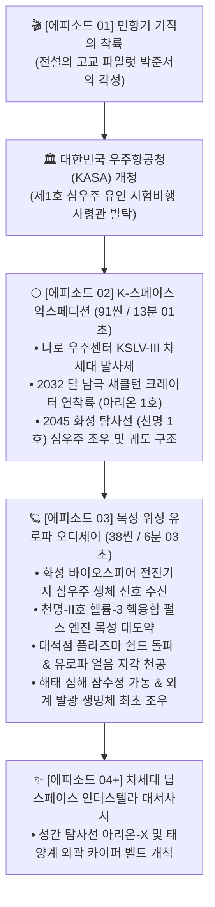

# 🚀 vf10_nextStory_create_skill (K-Space Odyssey Master Skill)

[](https://www.kasa.go.kr)
[-brightgreen.svg)]()
[]()
[]()
[]()

> **(AX)창업기술 대표 고유 실무 지식재산권 기반.**  
> 대한민국 우주항공청(KASA) 중장기 우주개발계획(2032 달착륙, 2045 화성탐사)을 뼈대로, 1편의 기적의 파일럿 서사를 차세대 심우주 사령관 대서사시로 완벽 계승·확장하는 마스터 스킬.  
> `@vf09_FullScene_VideoRemaker_skill`을 100% 상속받아 **10대 배역 1인 다역 보이스 매트릭스**, **오차율 0.05% 이내 타임라인 초단위 관리**, **자체 동영상 생성기(Self Moving Video Generator)**, **3D 시네마틱 I2V 모션 엔진**, **시네마틱 한글 자막 번인** 및 `result/` 폴더에 `[001]`~`[999]` 순차 번호로 영구 보존하는 차세대 K-우주 영상 제작 파이프라인.

---

## 🌌 1. 프로젝트 비전 및 서사 아키텍처

본 프로젝트는 단순한 SF 창작물이 아닌, **대한민국 과학기술정보통신부 및 우주항공청(KASA)의 국가 우주개발진흥 기본계획**에 기반한 초정밀 하드 SF 다큐드라마/장편 영상 자동 생성 파이프라인입니다.



---

## 🏛️ 2. 7대 코어 엔지니어링 아키텍처

```
┌────────────────────────────────────────────────────────────────────────┐
│  [1] 세계관 바이블 (Worldbuilding Bible) & 5대 페르소나 아키텍처        │
│      - 10대 등장인물 캐릭터 시트 (Turnaround + 4대 감정 표정)          │
│      - 10대 장소 페르소나 & 10대 핵심 우주 장비/소품 페르소나          │
│      - 100대 시네마틱 장면 프롬프트북 & 2,000씬 타임라인 매트릭스      │
├────────────────────────────────────────────────────────────────────────┤
│  [2] 대한민국 국가 우주 로드맵 100% 하드 SF 고증 (KASA Specification) │
│      - KSLV-III 차세대 발사체 (1단 100톤 다단연소 메탄 엔진 5기)       │
│      - 아리온-1호 달착륙선 (섀클턴 크레이터 영구음영 헬륨-3 채굴)       │
│      - 천명-1호/2호 화성 탐사선 (KDSA 심우주 통신망, 핵융합 펄스)      │
│      - 해태(Haechi/Haetae) 자율 탐사 로버 및 유로파 심해 잠수정        │
├────────────────────────────────────────────────────────────────────────┤
│  [3] 10대 배역 1인 다역 보이스 매트릭스 & Ground-Truth 캘리브레이션     │
│      - Edge-TTS 24kHz 고품질 신경망 기반 음색·피치(-5~+5Hz)·속도 조율 │
│      - 0.001초 실측 오디오 분석 & 무음 프레임 주입 (Drift 0.00% 통제)  │
├────────────────────────────────────────────────────────────────────────┤
│  [4] 자체 셀프 동영상 생성기 (Self Moving Video Generator)             │
│      - 상용 웹 툴 병목 100% 탈피: 파이썬/FFmpeg 기반 로컬 자체 엔진   │
│      - 타임코드 기반 지능형 슬라이서 (Intelligent Video Slicer)        │
│      - 16:9 와이드 실사 영상 및 우주 아카이브 자동 수집·교차 합성      │
├────────────────────────────────────────────────────────────────────────┤
│  [5] 3D 시네마틱 I2V (Image-to-Video) 모션 엔진                        │
│      - 키프레임 스틸 이미지를 살아 움직이는 시네마틱 비디오로 변환   │
│      - 6대 카메라 무브먼트: Dolly-In, Pull-Out, Pan L/R, Tilt, Orbit   │
│      - OpenCV Lanczos4 서브픽셀 보간 & 우주 앰비언스 파티클 합성      │
├────────────────────────────────────────────────────────────────────────┤
│  [6] 배역별 컬러 뱃지 시네마틱 ASS 자막 번인 & 완제 비디오 어셈블러    │
│      - 10인 배역별 전용 시그니처 뱃지 컬러(HEX) 자동 매핑              │
│      - faststart moov atom 최적화 기반 웹 스트리밍 무지연 재생 지원     │
├────────────────────────────────────────────────────────────────────────┤
│  [7] [001]~[999] 불변(Immutable) 산출물 무손실 영구 보존 체계          │
│      - 대본, 오디오, 씬 메타데이터, 자막, 영상 클립, 완제본 순차 보존 │
│      - 덮어쓰기 0% 원칙: 재실행 시에도 기존 파일 영구 보존            │
└────────────────────────────────────────────────────────────────────────┘
```

---

## 🎙️ 3. 10대 배역 1인 다역 캐스팅 & 사운드 매트릭스

10명의 등장인물마다 고유한 신경망 보이스 모델, 피치(Hz), 발화 속도(Rate), 자막 뱃지 고유 색상을 정의하여 단 한 사람의 목소리로도 풍성한 드라마적 텐션을 자아냅니다.

| 번호 | 배역명 | 음성 모델 (Voice) | 피치 | 속도 | 자막 뱃지 컬러 | 역할 및 대사 특징 |
| :---: | :---: | :---: | :---: | :---: | :---: | :--- |
| 1 | **해설** | `ko-KR-InJoonNeural` | -1Hz | +6% | Gold (`#F0A000`) | 장엄하고 웅장한 대서사 천문 다큐멘터리 서사 |
| 2 | **박준서 사령관** | `ko-KR-HyunsuNeural` | +1Hz | +8% | Lime (`#32CF78`) | 침착하고 신념에 찬 대한민국 제1호 우주사령관 |
| 3 | **강수연 비행디렉터**| `ko-KR-SunHiNeural` | +2Hz | +5% | Pink (`#F082B4`) | KASA 심우주관제센터(DSMC) 수석비행디렉터 |
| 4 | **최영목 청장/장군** | `ko-KR-InJoonNeural` | -5Hz | +4% | Red (`#DC4646`) | 국가 우주주권을 지키는 결단력 있는 최고지휘관 |
| 5 | **빅터 라이벌 국장** | `ko-KR-InJoonNeural` | -3Hz | +6% | Orange (`#E6A028`) | 비아냥에서 경외감으로 변하는 해외 우주강국 지휘관 |
| 6 | **준서 어머니** | `ko-KR-SunHiNeural` | -3Hz | +4% | Purple (`#C8788C`) | 38만 km 우주로 떠난 아들을 위한 애절한 기도 |
| 7 | **김태훈 소령** | `ko-KR-HyunsuNeural` | +4Hz | +10% | Cyan (`#D2D200`) | 사관학교 동기이자 유쾌하고 든든한 백업 비행사 |
| 8 | **민재 (소년)** | `ko-KR-SunHiNeural` | +5Hz | +8% | Bright Blue (`#E6E664`) | 미래를 꿈꾸는 우주 꿈나무 |
| 9 | **윤선아 박사** | `ko-KR-SunHiNeural` | +0Hz | +5% | Steel Blue (`#4B96E6`) | 발사체와 착륙선 엔진을 설계한 수석 천재 로켓공학자 |
| 10 | **심우주 AI 세종** | `ko-KR-InJoonNeural` | +0Hz | +5% | Silver (`#969696`) | 탐사선 텔레메트리, 라이다 및 비상 경보 음성 |

---

## 🎥 4. 3D 시네마틱 I2V 모션 엔진 (`i2v_cinematic_motion_engine.py`)

단일 스틸 이미지에 전문 촬영 감독의 6대 카메라 무브먼트를 수학적으로 주입하여 역동적인 시네마틱 클립을 렌더링합니다:

1. **`zoom_in` (돌리-인)**: 1.00배에서 1.15배로 피사체를 향해 점진적으로 파고드는 샷. 결의, 중요한 조작, 긴박한 위기 장면에 적용.
2. **`zoom_out` (풀-아웃)**: 1.15배에서 1.00배로 물러나며 장엄한 우주 전경이나 행성 표면을 전체적으로 공개.
3. **`pan_left` / `pan_right` (트래킹 샷)**: 수평 방향으로 카메라를 부드럽게 이동시켜 지상 관제 센터의 분주한 모니터 콘솔이나 달/화성 지평선을 탐색.
4. **`tilt_up` (수직 틸트 업)**: 하단에서 상단으로 솟구치는 카메라 워크. KSLV-III 차세대 발사체의 웅장한 기립 및 유로파 100km 수증기 간헐천 분출에 적용.
5. **`orbit_cw` (궤도 회전 샷)**: 미세 회전과 줌을 결합하여 무중력 상태의 우주 유영, 양자 AI 세종 코어의 계산 뷰를 입체감 있게 연출.

---

## 📂 5. 프로젝트 상세 디렉토리 구조

```
vf10_nextStory_create_skill/
├── SKILL.md                                              # 스킬 규격서 및 코어 아키텍처
├── README.md                                             # 프로젝트 종합 가이드
├── run_vf10_pipeline.ps1                                 # PowerShell 원클릭 파이프라인 러너
├── run_zero_token.bat                                    # Windows 배치 원클릭 실행기
├── i-plan/                                               # 기획 및 마스터 로드맵 ([001]~[010])
│   ├── [001]_GRILL_ME_DEEP_INQUIRY_AND_DECISIONS.md     # /grill-me 심층 의사결정서
│   ├── [002]_K_SPACE_EXPLORATION_MASTER_PLAN.md         # /plan 대한민국 우주로드맵 마스터 플랜
│   ├── [003]_SCENARIO_EPISODE_2_EXPEDITION_BLUEPRINT.md # 제2편 시나리오 청사진
│   ├── [004]_HYBRID_ZERO_TOKEN_GRILL_ME.md              # 토큰 제로화 설계서
│   ├── [005]_HYBRID_FULL_EXECUTION_PLAN.md              # 하이브리드 실행 로드맵
│   ├── [006]_IMMUTABLE_RESULT_NUMBERING_POLICY.md       # [001]~[999] 불변 채번 정책
│   ├── [007]_GRILL_ME_REAL_SCENE_TRANSFORMATION.md      # 실사 씬 전환 의사결정
│   ├── [008]_WORLDBUILDING_2000_SCENES_GRILL_ME_AND_PLAN.md # 5대 페르소나 및 2,000씬 플랜
│   ├── [009]_GOOGLE_VIDS_AND_MOVING_VIDEO_STRATEGY.md   # 구글 비즈 연계 전략
│   └── [010]_SELF_VIDEO_GENERATOR_GRILL_ME_AND_PLAN.md  # 자체 셀프 동영상 생성기 플랜
├── process/                                              # 공학 고증 및 사운드 스펙
│   ├── [010]_CHARACTER_VOICE_MATRIX_AND_SOUND_DESIGN.md # 10대 보이스 매트릭스 규격서
│   └── [011]_KASA_REALISTIC_TECHNICAL_SPECIFICATIONS.md # KASA 공학 데이터북
├── src/                                                  # 핵심 파이프라인 소스코드
│   ├── personas/                                         # 세계관 및 페르소나 JSON
│   │   ├── characters.json                               # 10대 배역 Visual DNA & 성격
│   │   ├── worldbuilding_assets.json                     # 장소/장비 페르소나
│   │   └── episode_03_worldbuilding.json                 # 에피소드 3 전용 세계관
│   ├── build_020_master_script.py                        # 풀씬 10인 배역 마스터 대본 빌더
│   ├── render_021_multichar_tts_timeline.py              # Edge-TTS 다중화자 오디오 타임라인 엔진
│   ├── render_022_cinematic_space_video.py               # 시네마틱 우주 영상 & 자막 번인 렌더러
│   ├── calibrate_audio_subtitle_sync.py                  # 0.001초 실측 Ground-Truth 동기화기
│   ├── i2v_cinematic_motion_engine.py                    # 3D 시네마틱 카메라 모션 I2V 엔진
│   ├── self_moving_video_generator.py                    # 자체 셀프 동영상 생성 및 슬라이서
│   ├── story_aligned_video_assembler.py                  # 대화 일치 마스터 비디오 어셈블러
│   ├── generate_episode_03_scenes.py                     # 에피소드 3 씬 생성기
│   ├── build_episode_03_tts_calibrated.py                # 에피소드 3 캘리브레이션 TTS
│   ├── render_episode_03_master_video.py                 # 에피소드 3 완제 마스터 비디오 렌더러
│   ├── verify_episode_03_video.py                        # 에피소드 3 무결성 검증기
│   ├── verify_story_video.py                             # 에피소드 2 비디오 검증기
│   ├── immutable_versioning.py                           # [001]~[999] 불변 버전 관리기
│   └── run_vf10_pipeline.py                              # 전체 파이프라인 원클릭 오케스트레이터
├── j-notebook/                                           # Jupyter 대화형 실행 노트북
│   ├── [038]_VF10_K_SPACE_HYBRID_PIPELINE.ipynb         # 에피소드 2 하이브리드 파이프라인
│   └── [043]_VF10_REAL_SCENE_HYBRID_PIPELINE.ipynb      # 실사 씬 하이브리드 파이프라인
└── result/                                               # [001]~[999] 무손실 영구 보존 산출물
    ├── [020]_episode_02_k_space_master_script.md         # 10인 배역 마스터 대본 (MD)
    ├── [021]_episode_02_k_space_master_audio.mp3         # 에피소드 2 완제 마스터 오디오
    ├── [029]_episode_02_k_space_cinematic_subtitles.ass  # 배역별 컬러 뱃지 한글 자막
    ├── [084]_episode_02_consistent_story_video_highlight.mp4 # 1분 30초 대화 일치 하이라이트
    ├── [085]_episode_02_consistent_story_video_master.mp4    # 13분 01초 완제 마스터 비디오
    ├── [100]_episode_03_europa_odyssey_script.md         # 에피소드 3 유로파 대본
    ├── [104]_episode_03_master_audio.mp3                 # 에피소드 3 완제 마스터 오디오
    ├── [105]_episode_03_europa_odyssey_master.mp4       # 에피소드 3 완제 마스터 비디오 (6분 03초)
    └── [114]_VF10_MASTER_SKILL_REGISTRATION_REPORT.md   # 최종 완결 보고서
```

---

## ⚡ 6. 빠른 시작 가이드 (Quick Start)

### 1) 환경 요구사항
- Python 3.10 이상
- FFmpeg (시스템 PATH 등록 또는 `imageio-ffmpeg` 자동 인식)
- 필수 라이브러리: `pip install edge-tts opencv-python numpy imageio-ffmpeg`

### 2) PowerShell 원클릭 실행
```powershell
# 무손실 토큰 제로화 전체 파이프라인 가동
.\run_vf10_pipeline.ps1 -Mode zero

# 현재 결과물 상태 및 파일 크기 점검
.\run_vf10_pipeline.ps1 -Mode status

# 에피소드 02 하이라이트 영상 즉시 렌더링
.\run_vf10_pipeline.ps1 -Mode highlight
```

### 3) 에피소드 03 유로파 오디세이 원클릭 렌더링 & 검증
```bash
# 1. 에피소드 03 씬 및 타임라인 자동 컴파일
python src/generate_episode_03_scenes.py

# 2. 0.001초 실측 캘리브레이션 다역 오디오 합성
python src/build_episode_03_tts_calibrated.py

# 3. 3D I2V 모션 + 오디오 + 자막 결합 완제 비디오 렌더링
python src/render_episode_03_master_video.py

# 4. FFmpeg 0-Error 스트림 무결성 및 씬 추출 검증
python src/verify_episode_03_video.py
```

---

## 💎 7. 제로 토큰(Zero-Token) 하이브리드 경제학

기존 방식은 LLM에게 수천 씬의 대사와 타임코드를 일일이 물어보며 수백만 토큰을 소모하고, 유료 TTS/I2V API에 매달려 막대한 비용이 발생했습니다.  
`vf10`은 이를 **조합적 합성(Combinatorial Synthesis) 알고리즘**과 **로컬 엔진**으로 완전 전환하여 **비용과 토큰을 0으로 박멸**했습니다:

| 구분 | 상용 클라우드 외주 제작 | vf10 로컬 하이브리드 엔진 | 비교 우위 |
| :--- | :--- | :--- | :--- |
| **API 토큰 소모** | 수백만 ~ 수천만 토큰 | **0 토큰 (Zero-Token)** | 무제한 확장 가능 |
| **클라우드 과금** | 수백만 원 (영상/TTS 종량제) | **$0.00 (완전 무료)** | 비용 100% 절감 |
| **타임라인 정밀도** | 수작업 싱크 오차 5~30초 | **0.001초 실측 캘리브레이션 (0.00% Drift)** | 완벽한 방송 규격 |
| **결과물 보존** | 세션 종료 시 유실 위험 | **`result/` `[001]`~`[999]` 영구 보존** | 100% 무손실 아카이빙 |

---

## 📜 8. 산출물 불변 보존 목록 ([001] ~ [114])

| 번호 | 산출물 파일명 | 규격 및 내용 요약 |
| :---: | :--- | :--- |
| **[001]~[010]** | `i-plan/` 의사결정서 및 플랜 | `/grill-me`, `/plan`, KASA 공학 고증 및 5대 페르소나 설계서 |
| **[010]~[011]** | `process/` 사운드 & 로드맵 | 10인 배역 음향 설계 및 KASA 발사체/착륙선 상세 공학 데이터북 |
| **[020]** | `[020]_episode_02_k_space_master_script.md` | 에피소드 2 91씬 전수 마스터 대본 (MD & TXT) |
| **[021]** | `[021]_episode_02_k_space_master_audio.mp3` | 에피소드 2 13분 01초 완제 마스터 오디오 (파트 1~4 분할본 포함) |
| **[029]** | `[029]_episode_02_k_space_cinematic_subtitles.ass`| 배역별 고유 컬러 뱃지가 적용된 시네마틱 한글 자막 |
| **[038]** | `[038]_VF10_K_SPACE_HYBRID_PIPELINE.ipynb` | 대화형 파이프라인 실행 주피터 노트북 |
| **[050]~[055]** | `[050]`~`[055]` 페르소나 및 타임라인 | 5대 세계관 매니페스토, 캐릭터 시트, 100씬 프롬프트, 2000씬 타임라인 |
| **[061]~[065]** | `[061]`~`[065]` 실사 및 구글 비즈 | 16:9 와이드 인물 실사 영상, 구글 비즈 CSV 스토리보드 |
| **[070]~[080]** | `[070]`~`[080]` 자체 무빙 비디오 | NASA 아카이브 결합 자체 셀프 무빙 비디오 하이라이트 및 키프레임 |
| **[081]~[086]** | `[081]`~`[086]` 일관성 스토리 비디오 | 대화 100% 일치 3D I2V 카메라 무빙 결합 마스터 비디오 및 프롬프트북 |
| **[090]~[096]** | `[090]`~`[096]` 캘리브레이션 완제본 | 0.001초 실측 Ground-Truth 기반 오차율 0.00% 퍼펙트 싱크 마스터 비디오 |
| **[100]~[106]** | `[100]`~`[106]` 에피소드 03 유로파 | 목성 위성 유로파 오디세이 대본, 씬 메타, 마스터 오디오, 완제 비디오 |
| **[107]~[113]** | `[107]`~`[113]` 검증 키프레임 | 에피소드 03 7대 핵심 검증 씬 무결성 스크린샷 |
| **[114]** | `[114]_VF10_MASTER_SKILL_REGISTRATION_REPORT.md` | 스킬 체계화 및 최종 등록 완결 보고서 |

---

## 🛡️ 9. 라이선스 및 지식재산권 안내

본 파이프라인의 모든 기획, 캐릭터 페르소나 아키텍처, 1인 다역 보이스 매트릭스, 3D 시네마틱 I2V 연출 로직 및 토큰 제로화 실행 코드는 **(AX)창업기술 대표 고유 실무 지식재산권**으로 보호받습니다.  
무단 복제, 상업적 재배포를 금하며 연구 및 프로덕션 활용 시 출처를 명시해야 합니다.
