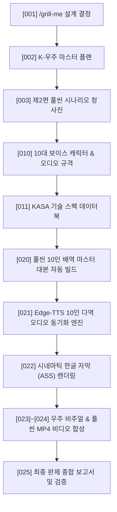

# [002] K-SPACE EXPLORATION MASTER PLAN & EXECUTION ROADMAP
## 제2탄: 대한민국 달 착륙선 '아리온' & 화성 탐사선 '천명' 통합 마스터 플랜

> **문서 번호**: `[002]`  
> **상위 전략**: 대한민국 제4차 우주개발진흥 기본계획 & 우주항공청(KASA) 우주항공 마일스톤  
> **프로젝트 코드명**: `Project Olympus-Arion (대한민국 심우주 원정대)`

---

### 1. 대한민국 국가 우주 로드맵 연계 구조

```
+---------------------------------------------------------------------------------------------------------+
|                              대한민국 심우주 탐사 대서사시 4대 마일스톤                                  |
+---------------------------------------------------------------------------------------------------------+
| [1단계] 2022~2026 : 다누리호(KPLO) 성공 및 누리호(KSLV-II) 4~6차 반복발사 신뢰성 확보                    |
| [2단계] 2028~2030 : 차세대 발사체(KSLV-III) 100톤급 다단연소사이클 엔진 및 재사용 메탄 추진체 완성         |
| [3단계] 2032년     : 대한민국 독자 달 착륙선 [아리온-1호] 달 남극 섀클턴 분지 무인/유인 시험 착륙 (본편)     |
| [4단계] 2045년     : 대한민국 차세대 심우주 화성 탐사선 [천명-1호] 화성 궤도 진입 및 전초기지 구축 (결말)    |
+---------------------------------------------------------------------------------------------------------+
```

---

### 2. 제2탄 4부작(Act 1~4) 서사 및 씬(Scene) 배분 계획

| 파트 (Part) | 소제목 | 상영 시간 | 주요 배경 및 사건 | 극적 갈등 및 클라이맥스 |
| :---: | :---: | :---: | :---: | :---: |
| **Act 1** | **푸른 별의 이륙 (Liftoff of the Blue Star)** | 00:00 ~ 15:00 | 나로우주센터 제2발사대, 고흥 상공 | 차세대 발사체(KSLV-III) 점화, 1단 분리, 2단 점화 후 궤도 진입 중 페어링 미세 간섭 극복 |
| **Act 2** | **38만 킬로미터의 침묵 (380,000 km of Silence)** | 15:00 ~ 30:00 | 지구-달 전이 궤도 (TLI), 심우주 텔레메트리 | 미확인 우주 파편군(Debris) 충돌 회피 기동, 외국의 비협조 속 독자 광학항법 가동 |
| **Act 3** | **달 남극의 기적 (Miracle at Lunar South Pole)** | 30:00 ~ 45:00 | 달 궤도(LOI), 섀클턴 크레이터 영구음영지역 | 역추진 스러스터 노즐 이상 발생, 박준서 사령관의 수동 벡터 추력 제어로 극적 연착륙 |
| **Act 4** | **붉은 행성을 향하여 (Towards the Red Planet)** | 45:00 ~ 60:00 | 달 표면 기지 & 화성 탐사선 '천명' 랑데부 | 태양 플레어 폭풍 극복, 화성 궤도 무인선 제어권 복구, 2045 대한민국 화성 착륙의 서막 선포 |

---

### 3. 엔지니어링 구현 및 파이프라인 단계



---

### 4. 핵심 준수 지침
1. **vf09 스킬 자산 100% 계승**:
   - 10대 배역 보이스 모델 및 피치/속도 파라미터 계승.
   - 슬롯 간격 무음 프레임 주입(Silence Injection)을 통한 타임라인 드리프트 0% 통제.
2. **무손실 결과물 보존**:
   - 모든 대본, 오디오, 자막, 영상 및 보고서는 `C:\Users\note\vf\vf10_nextStory_create_skill\result\` 폴더에 `[020]`~`[025]` 번호로 영구 보존.
3. **독자적 주권과 품격**:
   - 외세에 의존하지 않는 대한민국의 자립적 우주 기술(KSLV-III, 자립형 딥스페이스 안테나, 극저온 착륙 엔진)의 기술적 자긍심 고취.
