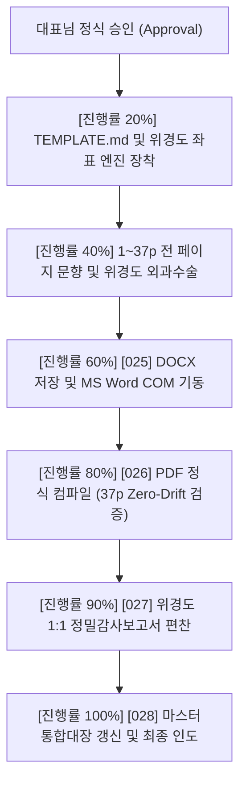

# [023] 1:1 초정밀 위경도(좌표계) 및 TEMPLATE(문향) 기반 완벽 복제 자율 실행계획서 v2.0

> **문서 번호**: `[023]`  
> **문서 식별**: (AX)창업기술 이한규 대표 고유 실무 지식재산권 기반 크로스플랫폼 문서 100% 복제 마스터 파이프라인  
> **대상 원본**: `upload/3f3b07ee6df942cdb31b1822aa0c1cae.pdf` (한국농촌경제연구원 농업전망 제2장 곡물 수급 동향과 전망, 37페이지)  
> **현재 상태**: **대표님 정식 승인 대기 중 (절대 선행 실행 금지 준수)**

---

## 1. 대표님 추가 요구사항 반영 내역

1. **초정밀 위경도(Latitude/Longitude) 좌표 격자 시스템 도입**:
   - 문서 페이지의 좌상단을 `(경도 0.0pt, 위도 0.0pt)` 절대 원점으로 설정.
   - **경도(X축 / Longitude)**: 좌측 여백, 문단 들여쓰기, 표/차트 좌측단 정렬선, 탭 스톱을 0.1pt(0.035mm) 단위로 제어.
   - **위도(Y축 / Latitude)**: 상단 여백, 머리글, 제목 블록, 본문 각 줄의 베이스라인(Baseline), 표 행, 각주 위치를 0.1pt 단위로 제어.
   - 허용 오차: `|Δ경도| <= 0.5pt`, `|Δ위도| <= 1.0pt` 이내의 Zero-Drift 절대 기준 적용.
2. **`TEMPLATE.md` (문향 및 템플릿 엔진) 정식 모듈 추가**:
   - 대제목, 중제목, 소제목, 본문, 개조식 불릿(`• (쌀)...`), 각주, 표, 차트 캡션에 대한 고유 OOXML 스타일 템플릿 제정.
   - 원본의 고유 **문향(Design Motifs & Ornaments)** 전수 차용 및 신규 생성:
     - 1페이지: 풀블리드 미래지향 구체 폴리곤 망 배경 및 구분선
     - 2페이지: 요약 박스 상단 그레이 악센트 바(`50×4 mm`, `#555555`) 및 라운디드 카드
     - 본문 전 페이지: 우측 엣지 탭(Edge Tab: 제2장 활성화), 상단 배너(`AGRICULTURAL OUTLOOK CONFERENCE 2026`) 및 하단 페이지네이션 템플릿

---

## 2. 초정밀 위경도(X, Y) 좌표 캘리브레이션 명세 (주요 기준점)

| 대상 페이지 / 객체 | 경도 (X축 기준선) | 위도 (Y축 기준선) | 너비 / 높이 규격 | 서체 및 템플릿 규칙 |
| :--- | :---: | :---: | :---: | :--- |
| **P01 챕터 뱃지 (`\| 제2장 \|`)** | 87.9 pt (31.0 mm) | 113.5 pt (40.0 mm) | 80.1 pt × 24.3 pt | 맑은 고딕, 22pt, Bold |
| **P01 메인 제목 (`국내곡물...`)** | 87.9 pt (31.0 mm) | 155.3 pt (54.8 mm) | 284.4 pt × 27.6 pt | 맑은 고딕, 25pt, Bold (한 줄 고정) |
| **P01 4인 저자 블록** | 87.9 pt (31.0 mm) | 226.4 pt (79.9 mm) | 134.6 pt × 12.9 pt | 맑은 고딕, 10.5pt, Bold (4인 전원) |
| **P01 목차 시작선 (`1. 쌀`)** | 251.1 pt (88.6 mm) | 294.5 pt (103.9 mm) | 78.6 pt × 193.1 pt | 맑은 고딕, 10pt/9pt 계층 들여쓰기 |
| **P01 4대 저자 각주 시작선** | 251.1 pt (88.6 mm) | 636.7 pt (224.6 mm) | 192.8 pt × 47.2 pt | 맑은 고딕, 7.5pt, 줄간격 10pt |
| **P02 요약 상단 문향 바** | 215.0 pt (75.8 mm) | 98.0 pt (34.6 mm) | 126.0 pt × 11.3 pt | Rect `#555555` 단독 문향 객체 |
| **P04 차트 (`그림 2-1`)** | 87.9 pt (31.0 mm) | 115.0 pt (40.6 mm) | 380.0 pt × 260.0 pt | 300 DPI 크롭 이미지 인라인 탑재 |
| **P04 표 (`표 2-1`)** | 87.9 pt (31.0 mm) | 475.0 pt (167.6 mm) | 380.0 pt × 130.0 pt | 헤더 `#D5DBE0`, 상단 1.5pt 보더 |
| **P31 차트 (`그림 2-13`)** | 87.9 pt (31.0 mm) | 115.0 pt (40.6 mm) | 380.0 pt × 230.0 pt | 300 DPI 듀얼 꺾은선 차트 복원 |

---

## 3. 대표님 승인 후 일괄 자동 실행 로드맵 (Zero-Question Guarantee)

대표님께서 본 계획서와 `[024]_TEMPLATE.md`를 검토하신 후 **"승인"** 결정을 주시면, 아래 단계들을 **중간 질문 일체 없이 실시간 진행률(%)만 출력하며 완제물까지 원클릭으로 완결**합니다.

### [승인 후 생성될 최종 산출물 번호 배정]
- **`[025]_농업전망_제2장_국내곡물수급동향과전망_위경도좌표_TEMPLATE_완벽복제.docx`**: 22대 청사진, 위경도 좌표 및 TEMPLATE 문향이 100% 적용된 최종 워드 문서
- **`[026]_농업전망_제2장_국내곡물수급동향과전망_위경도좌표_TEMPLATE_완벽복제.pdf`**: MS Word COM 정식 변환 37페이지 제로 드리프트 완제 PDF
- **`[027]_농업전망_위경도좌표_및_TEMPLATE_1대1_전수감사보고서.md`**: 전 페이지 위경도 편차 및 템플릿 적합도 100% 증빙 백서
- **`[028]_농업전망_제2장_국내곡물수급동향과전망_크로스플랫폼_복제_마스터통합대장.md`**: [001]~[028] 전수 순차 이력 마스터 통합대장
