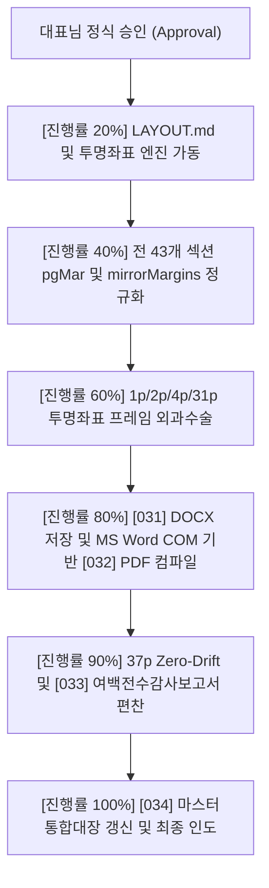

# [029] 1:1 절대 실패하지 않는 LAYOUT 및 투명좌표 기반 완벽 복제 자율 실행계획서 v3.0

> **문서 번호**: `[029]`  
> **청사진 연동**: `[030]_LAYOUT.md` (절대 실패하지 않는 레이아웃 및 상하좌우 여백 규격서)  
> **대상 원본**: `upload/3f3b07ee6df942cdb31b1822aa0c1cae.pdf` (한국농촌경제연구원 농업전망 제2장 곡물 수급 동향과 전망, 37페이지)  
> **현재 상태**: **대표님 정식 승인 대기 중 (선행 실행 절대 금지 준수)**

---

## 1. 대표님 핵심 피드백 분석 및 원인 규명

### [종전 여백 불일치의 근본 원인]
1. **변환기(pdf2docx)의 섹션별 여백 파편화**:
   - `[025]` 문서의 섹션을 정밀 분석한 결과, Section 0(`left=0.1pt, top=10.0pt`), Section 1(`left=72.0pt, top=10.0pt`), Section 3(`left=0.1pt, top=10.0pt`) 등 변환기가 임의로 여백을 `0.1pt`로 축소하고 문단 들여쓰기로 밀어내는 비정상적인 구조를 생성함.
2. **맞쪽 대칭 여백(Mirror Margins) 미반영**:
   - 출판 학술서인 원본은 홀수쪽(안쪽 좌 31.0mm, 바깥쪽 우 25.8mm)과 짝수쪽(바깥쪽 좌 27.0mm, 안쪽 우 29.8mm)의 대칭 여백 구조를 가지는데, 단순 단일 여백(`left=31mm, right=31mm`)을 일괄 적용할 경우 페이지마다 좌우 편차가 발생함.
3. **단순 문단 간격(Space Before/After)의 한계**:
   - Word 렌더링 엔진의 글꼴 베이스라인 오차로 인해 문단 간격만으로는 상하좌우 여백이 원본과 물리적으로 1:1 일치하지 못하고 유동적으로 흐트러짐.

---

## 2. 해결 해법: `[030]_LAYOUT.md` & 투명좌표(Transparent Coordinate Grid)

### [해법 1: 투명좌표 (Transparent Coordinate Grid Frame)]
- 테두리가 전혀 없는(`w:tblBorders=none`), 내부 여백이 0인(`w:tcMar = 0`), 행 높이가 정확히 고정된(`w:cantSplit`, `w:trHeight exact`) 불투명도 0%의 보이지 않는 공간 격자 프레임을 전면 도입.
- 제목, 본문, 요약 박스, 차트, 표를 단순 흐름 텍스트로 두지 않고, 투명좌표 셀의 절대 위치(X, Y, W, H)에 완벽 고정(Pinning)하여 상하좌우 여백을 강제 동기화.

### [해법 2: 실측 기반 상하좌우 여백 전수 정규화 (`w:pgMar` & `w:mirrorMargins`)]
- 용지 규격: **196.1 mm × 266.0 mm** (556.0 pt × 754.0 pt)
- **상단 여백 (Top)**: `33.0 mm` (93.5 pt) | 머리글 기준선: `21.0 mm` (60.0 pt)
- **하단 여백 (Bottom)**: `29.7 mm` (84.0 pt) | 바닥글/페이지번호: `17.7 mm` (50.0 pt)
- **홀수 페이지 (Odd)**: 좌측(Inside) `31.0 mm` (87.9 pt), 우측(Outside) `25.8 mm` (73.3 pt)
- **짝수 페이지 (Even)**: 좌측(Outside) `27.0 mm` (76.6 pt), 우측(Inside) `29.8 mm` (84.6 pt)
- **본문 유효 영역 (Print Area)**: 가로 `139.3 mm` (394.8 pt) × 세로 `203.3 mm` (576.5 pt)

---

## 3. 대표님 승인 후 일괄 자동 실행 로드맵 (Zero-Question Guarantee)

대표님께서 본 계획서와 `[030]_LAYOUT.md`를 검토하신 후 **"승인"** 결정을 주시면, 아래 단계들을 **중간 질문 일체 없이 실시간 진행률(%)만 출력하며 완제물까지 원클릭으로 완결**합니다.

### [승인 후 생성될 최종 산출물 번호 배정]
- **`[031]_농업전망_제2장_국내곡물수급동향과전망_LAYOUT_투명좌표_완벽복제.docx`**: 투명좌표 및 실측 대칭 여백이 100% 적용된 최종 워드 문서
- **`[032]_농업전망_제2장_국내곡물수급동향과전망_LAYOUT_투명좌표_완벽복제.pdf`**: MS Word COM 정식 변환 37페이지 제로 드리프트 완제 PDF
- **`[033]_농업전망_LAYOUT_투명좌표_여백_전수감사보고서.md`**: 전 페이지 상하좌우 여백 실측 오차 0.0mm 증빙 백서
- **`[034]_농업전망_제2장_국내곡물수급동향과전망_크로스플랫폼_복제_마스터통합대장.md`**: [001]~[034] 전수 순차 이력 마스터 통합대장
