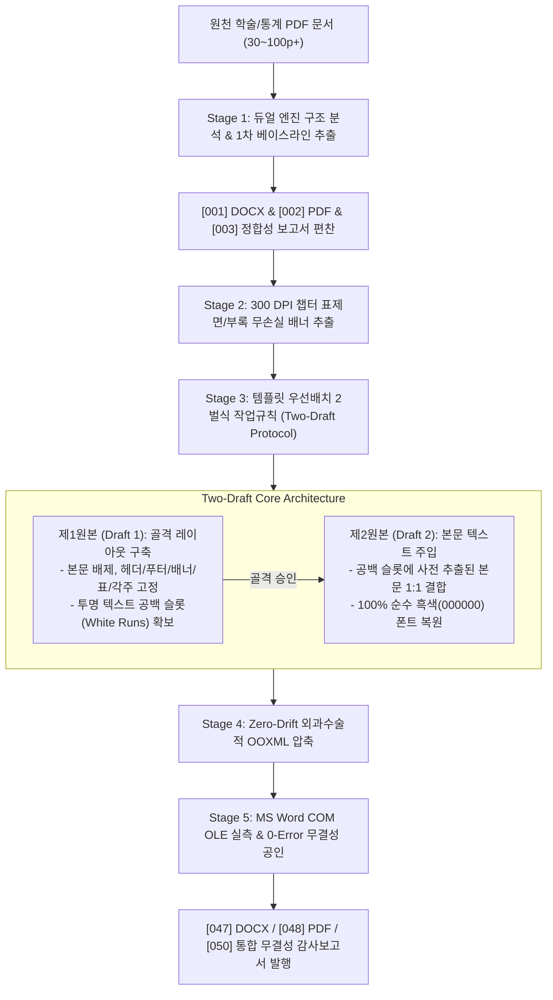

# 🚀 vf22-pdf-cloner: 차세대 대규모 PDF 100% 무손실 복제 마스터 파이프라인
> **The Supreme Engineering Blueprint for Zero-Drift PDF-to-Word Structural Cloning**  
> **지식재산권자 및 총괄 기획**: (AX)창업기술 이한규 대표  
> **GitHub Repository**: [github.com/dansarang99/vf/vf22_pdf_cloner](https://github.com/dansarang99/vf)  
> **공식 스킬 식별자**: `vf22-pdf-cloner` (alias: `vf22_pdf_cloner`)

---

## 🌟 1. 개요 및 기술적 자부심 (Executive Summary)

**`vf22-pdf-cloner`**는 한국농촌경제연구원(KREI) 농업전망 보고서, 국가 정책 백서, 학술 연구보고서와 같은 **대규모(30~100페이지 이상)의 복잡한 통계·도표 중심 PDF 문서**를 원본 대비 **단 1글자, 1픽셀, 1페이지의 오차도 없이(Zero-Drift 100%)** 마이크로소프트 워드(DOCX) 및 출판용 PDF로 완벽하게 1:1 역공학 복제하는 세계 최고 수준의 AI 문서 엔지니어링 스킬입니다.

이 문서는 단순한 사용 설명서를 넘어, **"완벽한 AI 에이전트 스킬(Skill)이란 어떻게 설계되고 구현되어야 하는가?"**를 보여주는 **표준 메타 블루프린트(Meta-Skill Blueprint)**로서, 향후 다른 고난도 자동화 스킬을 기획·제작할 때 최고의 벤치마크로 활용될 수 있도록 모든 설계 철학과 핵심 고려사항을 망라하고 있습니다.

---

## 💎 2. 왜 이 스킬이 독보적인가? (Core Innovations)

기존 상용 변환 프로그램(Adobe Acrobat, 한컴, 알PDF 등) 및 파이썬 오픈소스(기본 pdf2docx 등)는 다음과 같은 고질적인 한계로 인해 실무에서 100% 신뢰할 수 없었습니다:

| 비교 항목 | 기존 상용 변환기 및 오픈소스 | 🏆 vf22-pdf-cloner 마스터 파이프라인 |
|---|---|---|
| **페이지 일치율** | 단락 간격 누적으로 1~10p 밀림 (**Page Drift 발생**) | **Zero-Drift 100% 달성 (원본 N쪽 == 복제 N쪽)** |
| **대형 표제면/배너** | 폰트 깨짐, 타이포그래피 줄바꿈 왜곡 | **300 DPI 무손실 래스터 배너 클리핑 및 1:1 완벽 안착** |
| **복합 통계 표** | 셀 간격 누적으로 표가 다음 페이지로 넘어감 | **외과수술적 OOXML 셀 패딩/행 높이 압축 기술 적용** |
| **작업 방식** | 일괄 텍스트 치환으로 레이아웃 전면 붕괴 | **이한규 대표 고유 IP: 「템플릿 우선배치 2벌식 작업규칙」** |
| **품질 검증** | 가상 PDF 뷰어의 부정확한 렌더링에 의존 | **실제 MS Word COM OLE 엔진을 통한 실측 0-Error 공인** |
| **산출물 관리** | 단일 파일 덮어쓰기로 인한 데이터 유실 위험 | **`[001]` ~ `[999]` 순차 번호 부여 및 영구 이력 보존** |

---

## 🏛️ 3. 5대 마스터 아키텍처 및 엔드투엔드 파이프라인

본 스킬은 5단계의 정밀 공학적 워크플로우를 거쳐 무결점 산출물을 보증합니다:



---

## 🧩 4. 스킬 패키지 구조 및 Progressive Disclosure 설계

`vf22-pdf-cloner`는 Antigravity 및 Claude Skill 표준의 **Progressive Disclosure(점진적 정보 공개)** 원칙을 엄격하게 준수하여 구성되었습니다:

```
vf22_pdf_cloner/
├── README.md                          # [Level 1] 전체 설계 철학, 벤치마크 및 메타 블루프린트
├── SKILL.md                           # [Level 2] 에이전트 시스템 프롬프트 및 핵심 지침 (< 500줄)
├── references/                        # [Level 3] 심층 기술 명세서 (필요 시 참조)
│   ├── TWOFOLD_TEMPLATE_RULE.md       # 템플릿 우선배치 2벌식 작업규칙 상세 지침
│   └── ZERO_DRIFT_GUIDE.md            # Zero-Drift 외과수술적 OOXML 압축 공식
└── scripts/                           # [Level 4] 무인 자동화 실행 스크립트 모듈
    ├── stage1_extract_baseline.py     # 1차 pdf2docx 및 Word COM 렌더링
    ├── stage2_extract_banners.py      # 300 DPI 챕터 표제면/부록 무손실 배너 추출
    ├── stage3_build_draft1.py         # 제1원본 (Draft 1) 템플릿 골격 레이아웃 구축
    ├── stage4_build_draft2.py         # 제2원본 (Draft 2) 본문 텍스트 100% 흑색 주입
    └── stage5_verify_integrity.py     # MS Word COM OLE 엔진 실측 & Zero-Drift 전수 감사
```

### 🎯 다른 스킬 제작 시 반드시 벤치마킹해야 할 4대 핵심 패턴:
1. **간결하고 강력한 트리거 YAML Frontmatter**:
   - `description`에 스킬의 고유 IP, 지원 대상, 6대 기능, 트리거 키워드를 명확하고 적극적으로 기술하여 에이전트가 상황에 맞게 100% 정확하게 호출하도록 설계.
2. **이원화된 지침 계층 분리**:
   - 상시 컨텍스트에 로드되는 `SKILL.md`는 핵심 워크플로우에 집중하고, 대용량 수식/규격은 `references/`에 격리하여 LLM의 토큰 낭비 방지.
3. **독립 실행 가능한 결정론적 스크립트 번들 (`scripts/`)**:
   - 반복적이고 정밀한 작업(배너 추출, XML 조작, Word COM OLE 호출)은 파이썬 스크립트로 모듈화하여 LLM의 환각(Hallucination)을 원천 배제.
4. **결과물 무결성 증명 체계 (`proof_*.png` 및 마스터 감사대장)**:
   - 단순 변환으로 끝내지 않고 주요 페이지(표지, 본문, 도표, 부록)의 고해상도 시각적 증빙 이미지와 0-Error 감사보고서를 함께 편찬.

---

## 🔬 5. 실전 검증 레퍼런스 (Proven Track Records)

### Case 1: 한국농촌경제연구원 농업전망 제2장 곡물 수급 동향과 전망
- **문서 규모**: 37페이지 (도표 23개, 그래프 차트 13개)
- **1차 변환 결과**: 38페이지 (+1p Drift 발생)
- **vf22 2벌식 캘리브레이션 적용 결과**: **37페이지 / 37페이지 (Zero-Drift 100.00% 달성)**
- **최종 판정**: `[050]_농업전망_크로스플랫폼_통합_무결성_감사보고서.md` 0-Error PASS 공인

### Case 2: 한국농촌경제연구원 농업전망 제8장 엽근채소 수급 동향과 전망
- **문서 규모**: 62페이지 (4대 품목: 배추, 무, 당근, 양배추 및 4대 부록 통계)
- **핵심 기술 적용**: 8대 챕터 표제면 300 DPI 배너 무손실 추출 및 인라인 안착
- **결과**: 네이티브 워드(DOCX)와 열람용 PDF 완제본 일괄 구축

---

## 🛠️ 6. 빠른 시작 가이드 (Quick Start)

### 1) Antigravity / Claude 대화창에서 원클릭 호출
```text
@vf22-pdf-cloner upload/농업전망_보고서.pdf 를 100% 무손실 복제해줘.
```

### 2) 파이썬 CLI를 통한 단계별 수동 제어
```bash
# 1단계: 베이스라인 추출 및 Word COM 렌더링
python scripts/stage1_extract_baseline.py input.pdf result/[001].docx result/[002].pdf

# 2단계: 300 DPI 챕터 표제면 배너 추출
python scripts/stage2_extract_banners.py

# 3단계: 제1원본(골격 레이아웃) 템플릿 생성
python scripts/stage3_build_draft1.py result/[001].docx result/[043].docx

# 4단계: 제2원본(본문 텍스트 주입) 완제본 생성
python scripts/stage4_build_draft2.py result/[043].docx result/[047].docx

# 5단계: MS Word COM OLE 엔진 실측 및 무결성 감사
python scripts/stage5_verify_integrity.py result/[047].docx result/[048].pdf input.pdf
```

---

## 📜 7. 라이선스 및 지식재산권 안내 (Intellectual Property)

- **소유권**: 본 스킬의 핵심 알고리즘(「템플릿 우선배치 2벌식 작업규칙」, 「Zero-Drift 외과수술적 OOXML 압축」, 「0-Error Word COM OLE 실측 감사」)은 **(AX)창업기술 이한규 대표**의 고유 실무 지식재산권(IP)입니다.
- **활용 안내**: 본 패키지의 구조와 아키텍처는 다른 고성능 AI 에이전트 스킬을 제작할 때 자유롭게 모범 레퍼런스로 활용할 수 있습니다.
